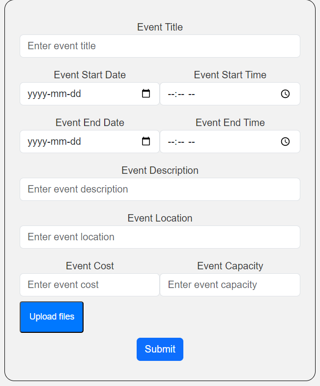
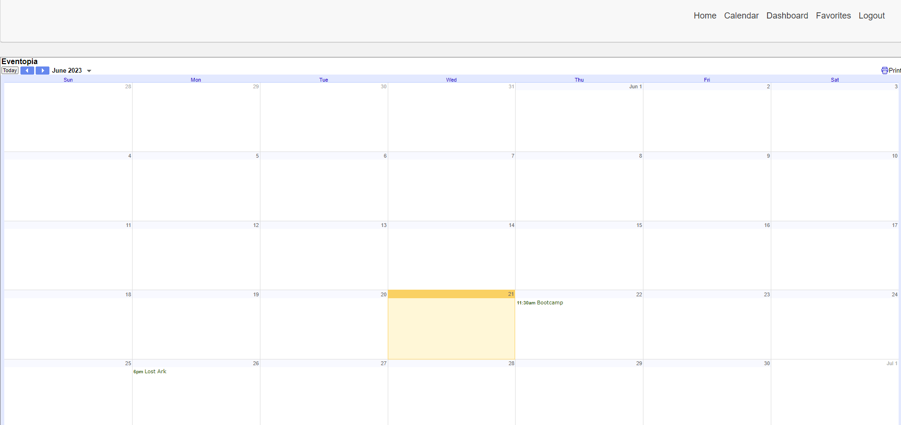
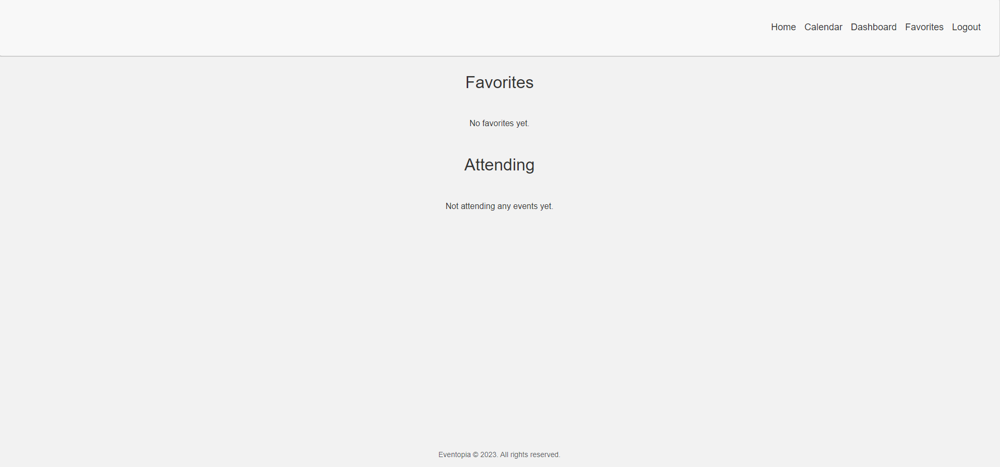

# Eventopia
Link to the deployed application on Heroku: https://eventopia-ea333846024a.herokuapp.com/

## Introduction
This is a simple event management application built with Node.js, Express, and Sequelize that is deployed on Heroku. It allows users to create, edit, and delete events, as well as authenticate and sign up. Calendar option helps track your future events.

## Table of Contents
- [Introduction](#introduction)
- [Features](#features)
- [Technologies Used](#technologies-used)
- [Getting Started](#getting-started)
- [Usage](#usage)
- [Limitations](#limitations)
- [Licenses](#licenses)
- [Contributors](#contributors)

## Features
Event Creation: Allows users to create, edit, and delete events. Gives users options to favourite events.

Sign-up: Allows users to login and signup through authentication to be able to save their data.

Calender: Allows users to add their events to a calender. There also will be a option to see all events through the calender.

## Technologies Used
- express: Fast, unopinionated, minimalist web framework for Node.js
- bcryptjs: Library for hashing and comparing passwords
- express-session: Session middleware for Express.js
- dotenv: Loads environment variables from a `.env` file
- mysql: relational database management system based on structured query language (SQL)

## Getting Started
### 1. Installation
1. Clone the repository: `git clone https://github.com/PacoCasillas/Eventopia.git`
2. Navigate to the project directory: `cd Eventopia`
3. Install dependencies: `npm install`

### 2. Setting up

1. Create a MySQL database for the application.
2. Create the .env file.
3. Set the required environment variables in the `.env` file:
   -env.DB_NAME,
   -env.DB_USER,
   -env.DB_PASSWORD
4. Get the Calendar ID and credentials from the google API and set it up in the .env file.

## Usage

1. Start the server: `npm start` or use npx nodemon
2. Open a web browser and navigate to `http://localhost:3001` (or the configured port number).
3. Sign up for a new account or log in with existing credentials.
4. Use the provided interface to create, edit, and delete events.
5. Use the provided interface to browse all events and favourite them.

Here are some images of the deployed application:

Here is the dashboard where you can create events:

This is how it looks when you click on Create event:

## Limitations
1. Scalability: Handling a large number of concurrent users or events. As the user base or event count grows, the performance and responsiveness of the page could be affected.
2. Accessibility: Event page is accessible to users with disabilities. Meeting accessibility standards and providing alternative methods of interaction for individuals with different needs.
3. Purchasing: Adding a ticket purchasing option. Allowing users to create events that have ticket purchasing options when registrating for an event.
4. Third-party integrations: To deploy on Heroku, costs money to run the website. Adding in different dynos also require money. Rate limits, data access restrictions, or changes in API functionality can impact the event page.
5. Event management features: Implementing certain features; such as reminders, notifications, or advanced event customization options. Incentives and efficiency when creating and managing an event.
6. Security: Implementing security measures to protect user data, prevent unauthorized access, and mitigate potential vulnerabilities.

## Licenses
This project is licensed under the [MIT License](LICENSE).

## Contributors
* [Francisco Olivares](https://github.com/PacoCasillas) 
* [Elisa Marchete](https://github.com/ElisaMarchete) 
* [Andy Zhong](https://github.com/timebytes)
* [Kajian Pulenthirasingam](https://github.com/kajianpulenthirasingam)
